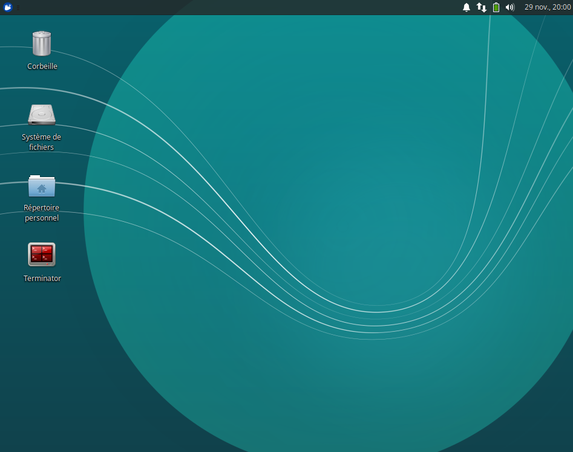
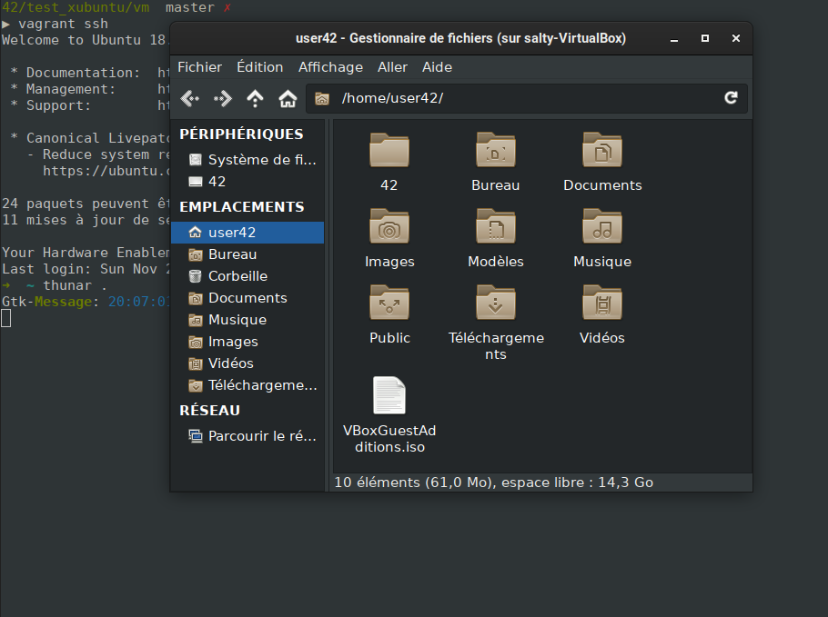

# 42 xubuntu correction VM on Vagrant

This vagrant box is based on the official 42 xubuntu VirtualBox VM. It support X11 forwarding



**If you just want to use the box, please use the [Vagrant Hub](https://app.vagrantup.com/nirae/boxes/42_xubuntu) last stable version**

`vagrant init nirae/42_xubuntu && vagrant up`

Just launch `vagrant ssh` and get a ssh connection on the VM!

The current directory will be synced with the guest directory `/home/user42/42`, on the vm.

**What is the X11 Forwarding?**

On your ssh connection, if you need to launch a graphic applications, (classical or a 42 project), just run the program and you can interact with it!

Exemple with Thunar, the file manager of XFCE




### Enable Gui

By default, the Gui is disabled but you can enable it by changing the settings in your Vagrantfile

```ruby
# -*- mode: ruby -*-
# vi: set ft=ruby :

Vagrant.configure("2") do |config|

    config.vm.box = "nirae/42_xubuntu"
  
    config.vm.provider "virtualbox" do |vb|
      vb.gui = true
    end
end
```

### Changing some hardware parameters

You can also ajust the performance settings by changing the memory, vram, etc..

Create or change the Vagrantfile

```ruby
# -*- mode: ruby -*-
# vi: set ft=ruby :

Vagrant.configure("2") do |config|

    config.vm.box = "nirae/42_xubuntu"
  
    config.vm.provider "virtualbox" do |vb|
      vb.memory = 2048
      vb.cpus = 2
    end
end
```


